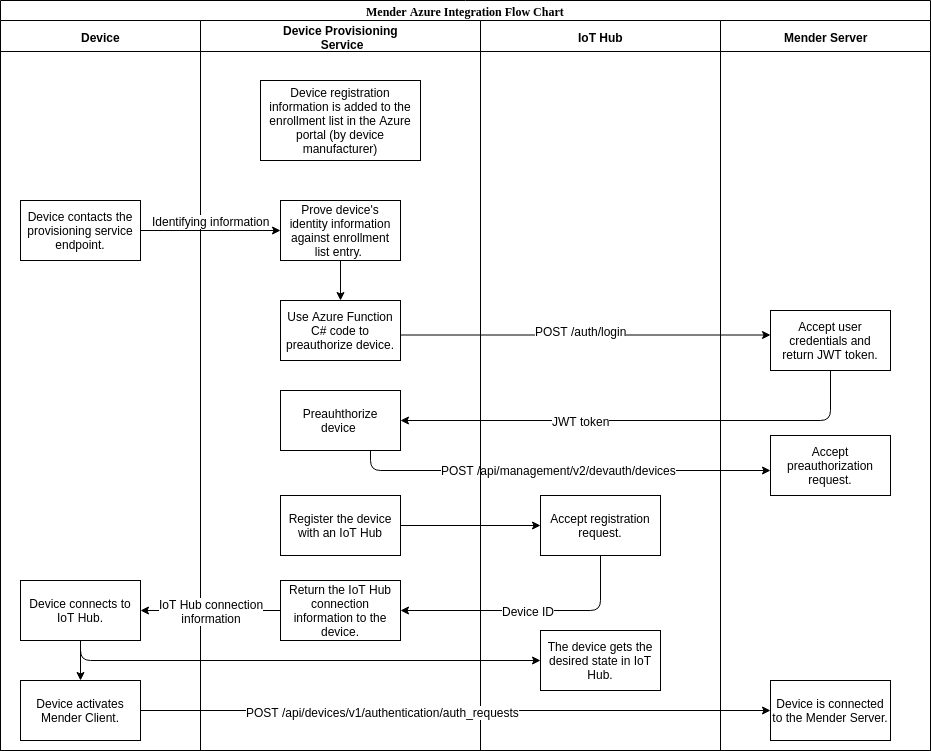

## Azure DPS and IoT Hub authentication integration

This integration automates authentication of devices in Hosted Mender.
When devices are provisioned into Azure Device Provisioning Service, they are also automatically preauthorized in Hosted Mender
so the Mender client can immediately start deploying software updates to provisioned devices.

See the diagram below for the flow provided by this integration.



Note that this integration is **only intended as a reference demo**. Adjustments need to be made
before running it in production to ensure adequate levels of security and automation.


## Prerequisites

#### Clone the integration

```bash
git clone git@github.com:mendersoftware/mender-server-integrations.git
```

This tutorial assumes you are cloning it to your home directory (`~`), so you need to adjust
a few steps below if you are using a different directory.


#### Install dependencies on your laptop or workstation

Install the latest version of these build dependencies:

* [git](https://git-scm.com/download/)
* [CMake](https://cmake.org/download/)
* [OpenSSL](https://www.openssl.org/)

#### Sign up for a Hosted Mender account

[Sign up for Hosted Mender](https://mender.io/signup).

#### Sign up for an Azure account

[Sign up for Azure](https://azure.microsoft.com/en-us/free/) and log in to the [Azure portal](https://portal.azure.com).


## Create an Azure IoT Hub and Device Provisioning Service

Follow [these instructions](https://docs.microsoft.com/en-us/azure/iot-dps/quick-setup-auto-provision), while applying the adjustments below:


#### Create an Azure IoT Hub 

An Azure IoT Hub helps to connect, monitor and manage your IoT assets.
Use this configuration for the new IoT Hub:

* Resource group: `mender-azure-test-hub-group`
* IoT Hub Name: `mender-azure-test-hub`

Click Next: *Size and Scale* to continue. Use these settings:
* Pricing and scale tier: `F1 for Free`
* Number of free Messages per day: reduced to `8000 per day` (from 400 000 for S1: Standard Tier)
* Device-to-cloud-partitions: reduced to `2` (from 4)

Click *Review + Create* to continue, then click *Create*.

It can take up to 10 minutes to complete creation.


#### Create an Azure Device Provisioning Service

An Azure Device Provisioning Service (DPS) provides seamless, zero-touch registration of devices to an IoT Hub with security that begins at the device and ends with Microsoft cloud.

Use this configuration for the DPS:

* Name: `mender-test-provisioning-service`
* Rest of the fields: use the automatic defaults

Click *Create* to create your new Device Provisioning Service.

Now you need to link your IoT hub and Device Provisioning Service.
Select *Linked IoT hubs* and click the *+ Add* button

* IoT hub: `mender-azure-test-hub`
* Access Policy: `iothubowner`
* Rest of the fields: use the automatic defaults


## Generate and add an X.509 root certificate to your IoT Hub

In this section and the following we will generate the required certificates for
authenticating with Azure. To keep the steps to a minimum we will
only consider individual enrollment in the IoT Hub, but this can be extended.

The X.509 certificate-based security in Azure DPS requires you to start with an X.509
certificate chain, which includes the root certificate as well as any intermediate
certificates up until the leaf certificate. 

The steps below are for Unix/bash, refer to
[Generating test CA certificates](https://github.com/Azure/azure-iot-sdk-c/blob/master/tools/CACertificates/CACertificateOverview.md)
for Powershell instructions and a more in-depth explanation.

First we need to download and run the certificate generation scripts. Run the following commands:

```bash
mkdir ~/certs
cd ~/certs
git clone https://github.com/Azure/azure-iot-sdk-c.git
cd azure-iot-sdk-c/tools/CACertificates
chmod +x certGen.sh
./certGen.sh create_root_and_intermediate
```

Now you should have the required certificates. Please **keep this terminal open** as we will return to it later.

Open the *Azure IoT Hub* console in your web browser. Then click on the IoT Hub you created above (mender-azure-test-hub),
followed by *Certificates* and *Add*. Fill in the following:
* Name: `mender-test-root`
* Browse to upload the certificate you generated at `~/certs/azure-iot-sdk-c/tools/CACertificates/certs/azure-iot-test-only.root.ca.cert.pem`.

Then click *Save*.

The certificate should now have status *Unverified*, so we will verify it next.

Click on the certificate, then find *Certificate Details*. Click on *Generate Verification Code*.
Copy this code (similar to 106A5SD242AF512B3498BD6098C4941E66R34H268DDB3288) to the clipboard.
Please **keep this browser tab open** as we will return to it soon.

Now go back to the terminal from above (you should be standing in the `CACertificates` directory) and run the following commands:

```bash
VERIFICATION_CODE= #PASTE IT INTO THE TERMINAL
```

```bash
./certGen.sh create_verification_certificate $VERIFICATION_CODE
```

Again, please **keep this terminal open** as we will return to it later.

Go back to the Certificate Details in the *Azure IoT Hub web console*, and find *Verification code*. Click *Browse*.
Browse to the verification certificate at `~/certs/azure-iot-sdk-c/tools/CACertificates/certs/verification-code.cert.pem`.
Then click *Verify*. Your root certificate should now show as Verified.


## Generate an X.509 device certificate

Your devices will authenticate using certificates signed by the root certificate we just generated and verified above.

First, return to the terminal from above and run the following commands:

```bash
./certGen.sh create_device_certificate mender-azure-test-device1
cat certs/new-device.cert.pem certs/azure-iot-test-only.intermediate.cert.pem certs/azure-iot-test-only.root.ca.cert.pem > certs/new-device-full-chain.cert.pem
```

We will use the generated files later when enrolling the device.


## Encode your Hosted Mender credentials into the Azure function HttpTrigger1.cs

In order for our custom Azure function to preauthorize devices to Hosted Mender,
we first need to encode the Hosted Mender credentials it should use and then add them to the function.

Note that encoding the Hosted Mender credentials in the function itself can be insecure if other users
have access to your Azure function. In this case the function should be adjusted to obtain the credentials
from a secure system, but this would complicate the design for the purpose of this tutorial as the function
would have to authenticate itself as well.

First [sign up for Hosted Mender](https://mender.io/signup) if you have not done so already.

Open a terminal and run the following commands (assuming a Unix shell is used) to encode your credentials
into a shell variable:

```bash
cd # or change to a temporary working directory
HOSTED_MENDER_EMAIL=# INSERT YOUR ACCOUNT EMAIL
HOSTED_MENDER_PASSWORD= #INSERT YOUR ACCOUNT PASSWORD
CREDENTIALS_ENCODED=$(echo -n "$HOSTED_MENDER_EMAIL:$HOSTED_MENDER_PASSWORD" | base64)
```

Now we will add these credentials in the right place in the `HttpTrigger1.cs` function.
It is provided as an asset together with this tutorial, so you might need to adjust the first command
to the correct path to the `mender-server-integrations` repository.

```bash
cp ~/mender-server-integrations/azure-dps-iot-hub-auth/azure-enrollment-function/HttpTrigger1.cs .
```

GNU sed (Ubuntu)
```
sed -i "s/REPLACE_WITH_HOSTED_MENDER_CREDENTIALS/$CREDENTIALS_ENCODED/g" HttpTrigger1.cs
```

BSD sed (MacOS)
```
sed -i '' "s/REPLACE_WITH_HOSTED_MENDER_CREDENTIALS/$CREDENTIALS_ENCODED/g" HttpTrigger1.cs
```

Keep the resulting file `HttpTrigger1.cs`, as we will attach it to a device enrollment entry below
so that it can preauthorize devices to Hosted Mender as they are enrolled into Azure.


## Create a custom device enrollment entry

Next we will configure Azure DPS to authenticate our device which will be using the generated certificate and
run the Azure function that preauthorizes the device in Hosted Mender.

Go to the *Azure portal*, click on *All Resources* in the left-hand menu and open your *Device Provisioning Service*.
Select the *Manage Enrollments* tab and click *Add Individual Enrollment*. Fill in these fields:

* Primary Certificate: Browse to `~/certs/azure-iot-sdk-c/tools/CACertificates/certs/new-device-cert.pem`
* How You Want to Assign Devices to Hubs: `Custom (Use Azure Function)`
* Make sure `mender-azure-test-hub.azure-devices.net` is listed in the IoT Hubs List and that enrollment can be assigned to it.

In the same dialog, scroll down to the *Select Azure Function section* and click *Create a new function app* and input the following:
* App Name: `mender-test-function-app-x509`
* Resource group: Use existing; Select `mender-azure-test-hub-group`
* Runtime stack: `.NET`
* Click *Create*.

Go back to the *Add Enrollment* page and **make sure your new function app is selected**;
you may have to re-select the subscription to refresh the function app list. Then click *Create a new function* and fill in the following:

* On your function app, click *New function*
* Chose a development environment: `In-portal`
* Create a function: `Webhook + API`
* Click *Create* to create your new HttpTrigger1 C# function.

**Replace default C# code** with the HttpTrigger1.cs function from above (with your encoded credentials). Click *Save*.

Go back to the *Add Enrollment* page again and **make sure your new function is selected**;
you may have to re-select the Function App to refresh the functions list.

Click *Save* to complete the enrollment.


## Provision a BeagleBone Black device

As a reference we will use a BeagleBone Black device to connect to Azure and Hosted Mender, though
it should be quite straightforward to adjust to use a different device.


#### Create a Debian image with Mender support

First we need to create a Debian image which has Mender installed and configured for your Hosted Mender account.

Download the [Debian Stretch IoT image](https://debian.beagleboard.org/images/bone-debian-9.5-iot-armhf-2018-10-07-4gb.img.xz) which supports the BeagleBone Black.

Next, [follow the documentation for mender-convert](https://docs.mender.io/artifacts/debian-family) to convert this image
into an image with Mender installed and correctly configured. Note that this process may take you 30-60 minutes.


#### Do post-configuration of the image with identity and credentials

We want the Mender client to use the same identity and credentials that were configured in Azure.
The easiest approach to carry out this post-configuration is to write the image from above to a SD card
and insert it into your laptop or workstation. From this you should have access to the partitions.
If they are not automatically mounted when you insert the SD card, need to mount them so you can access the files.
There are four partitions: primary, secondary, data and boot. We need to make some small modifications to all of them, except `boot`.

First we modify the `data` partition. Copy the file we generated above on your laptop or workstation from
`~/certs/azure-iot-sdk-c/tools/CACertificates/private/new-device.key.pem` to `/mender/mender-agent.pem`
on the `data` partition.

We also need to copy a second file to the data partition: the certificate used to provision
with DPS. On your laptop or workstation this file is found at `~/certs/azure-iot-sdk-c/tools/CACertificates/certs/new-device.cert.pfx`.
Copy it to `/data/mender/mender-certificate.pfx` on the data partition.

Next, we modify the `primary` and `secondary` partitions (in identical ways). On **both** the primary and secondary
partitions, open `/usr/share/mender/identity/mender-device-identity` in a text editor. Replace the
content of these files with the following:

```bash
echo "DeviceId=mender-azure-test-device1"
```

This ensures that Mender uses the same identity scheme as Azure; `mender-azure-test-device1` is the CN
in the device certificate we generated above and will use with the device. Note that while we are setting
this manually for purposes of keeping this tutorial simple, we can extract this from the certificate itself
in real scenarios by adjusting the `mender-device-identity` script accordingly.


#### Boot the BeagleBone Black with the new SD card

Unmount (or safely disconnect) the SD card partitions from your laptop or workstation. Then eject the SD card
and insert it into the BeagleBone Black. Make sure you have network set up (e.g. using an Ethernet cable with DHCP)
and *boot* up the BeagleBone. Note that you might have to press and hold the *S2* button on the BeagleBone Black for it
to boot from SD card.

As soon as it boots up, log in to it over SSH (default credentials are `debian` / `temppwd`). Then stop the Mender
client service temporarily by running:

```bash
sudo systemctl stop mender
```

Not open your Hosted Mender account in a web browser. Go to Devices -> Pending. Your BeagleBone might already have
made an authorization request to Hosted Mender; if so it will show under Pending. If you see it, please *Dismiss* it
(you might also need to remove it from the *Rejected* tab under Devices, so take a look there as well).

Next run the following commands on the BeagleBone Black to install some dependencies we need for cross-compiling
and running the Azure DPS provisioning client:

```bash
sudo apt-get update && sudo apt-get install -y git cmake build-essential curl libcurl4-openssl-dev libssl-dev uuid-dev
```


## On your workstation/laptop, set up a build environment for cross-compiling

Note that there is a *prebuilt DPS provisioning client* executable available at
`~/mender-server-integrations/azure-dps-iot-hub-auth/device-applications/prov_dev_client_bbb_prebuilt`.
For testing it is recommended to use this instead of following the steps below to save time.
Simply find that file and go to the last step in this section (*Copy the Azure DPS provisioning client to your device*).

In the following we will cross-compile an Azure DPS provisioning client for our BeagleBone Black device so we can
provision our device with Azure DPS. In order to build a DPS client, we need a cross-compiler toolchain that
is compatible with the BeagleBone, some libraries from the BeagleBone itself (we installed them in the previous section)
and the Azure IoT SDK.

Throughout the following we will set some environment variables, so **make sure to use the same terminal**
when running the commands below.


#### Install and configure the cross-compiler toolchain

First, create a directory for the toolchain, download and unpack the Linaro cross-compiler:

```bash
mkdir ~/BeagleBoneToolchain
cd ~/BeagleBoneToolchain
wget https://releases.linaro.org/components/toolchain/binaries/7.4-2019.02/arm-linux-gnueabihf/gcc-linaro-7.4.1-2019.02-x86_64_arm-linux-gnueabihf.tar.xz
unxz gcc-linaro-7.4.1-2019.02-x86_64_arm-linux-gnueabihf.tar.xz
tar xvf gcc-linaro-7.4.1-2019.02-x86_64_arm-linux-gnueabihf.tar
```

Next we need to copy some libraries from the BeagleBone itself. Run the following commands, inserting the IP address
of your BeagleBone Black (you can ignore any error copying `/usr/sbin/beagle-tester` as it is not needed):

```bash
BEAGLEBONE_IP_ADDRESS= # INSERT HERE
cd ~/BeagleBoneToolchain/gcc-linaro-7.4.1-2019.02-x86_64_arm-linux-gnueabihf/arm-linux-gnueabihf
rsync -rl --safe-links debian@$BEAGLEBONE_IP_ADDRESS:/{lib,usr} .
```

Now set an environment variable for the BeagleBone root directory:

```bash
export BBB_ROOT=$(pwd)
```

We also need to adjust some linker settings. Run the following commands:

```bash
mkdir $BBB_ROOT/etc
vim $BBB_ROOT/etc/ld.so.conf  # or use your text editor of choice
```

Then fill this file with the following contents:

```bash
/lib/arm-linux-gnueabihf
/usr/lib/arm-linux-gnueabihf
/usr/local/lib
```

Finally, we create a CMake Toolchain file. Run the following command:

```bash
vim ~/BeagleBoneToolchain/toolchain-bbb.cmake   # or use your text editor of choice
```

Then fill this file with the following contents:

```bash
INCLUDE(CMakeForceCompiler)

SET(CMAKE_SYSTEM_NAME Linux)
SET(CMAKE_SYSTEM_VERSION 1)
# this is the location of the ARM toolchain targeting the BeagleBone
SET(CMAKE_C_COMPILER $ENV{BBB_ROOT}/../bin/arm-linux-gnueabihf-gcc)
SET(CMAKE_CXX_COMPILER $ENV{BBB_ROOT}/../bin/arm-linux-gnueabihf-g++)
SET(CMAKE_SKIP_BUILD_RPATH FALSE)
SET(CMAKE_BUILD_WITH_INSTALL_RPATH TRUE)
SET(CMAKE_INSTALL_RPATH_USE_LINK_PATH TRUE)

# this is the file system root of the target
SET(CMAKE_FIND_ROOT_PATH
	$ENV{BBB_ROOT}
	$ENV{BBB_ROOT}/usr/lib
	$ENV{BBB_ROOT}/usr/lib/arm-linux-gnueabihf
	)

SET(CMAKE_INSTALL_RPATH $ENV{BBB_ROOT};$ENV{BBB_ROOT}/usr/lib/arm-linux-gnueabihf)

# search for programs in the build host directories
SET(CMAKE_FIND_ROOT_PATH_MODE_PROGRAM NEVER)

# for libraries and headers in the target directories
SET(CMAKE_FIND_ROOT_PATH_MODE_LIBRARY ONLY)
SET(CMAKE_FIND_ROOT_PATH_MODE_INCLUDE ONLY)
```

We also set the path to this file as an environment variable to easily refer to it:

```bash
export TOOLCHAIN_BBB_FILE=~/BeagleBoneToolchain/toolchain-bbb.cmake
```


#### Download and configure the Azure IoT SDK

Now that we have a working build environment for our device, we will use it
to build an Azure DPS provisioning client using the Azure IoT SDK.

Download the Azure IoT SDK with the following commands:

```bash
cd ~
git clone https://github.com/Azure/azure-iot-sdk-c.git
cd azure-iot-sdk-c/
git checkout -b 2019-04-30 2019-04-30
git submodule init
git submodule update --init --recursive
```

Next copy two applications that we will build using the SDK (we will replace an existing one with the first application),
by running the following commands:

```bash
cd ~/azure-iot-sdk-c/provisioning_client/samples
rm -rf custom_hsm_example
cp -r ~/mender-server-integrations/azure-dps-iot-hub-auth/device-applications/custom_hsm_example/ .
cp -r ~/mender-server-integrations/azure-dps-iot-hub-auth/device-applications/prov_dev_client_bbb/ .
echo 'add_sample_directory(prov_dev_client_bbb)' >> ~/azure-iot-sdk-c/provisioning_client/samples/CMakeLists.txt
```


#### Cross-compile the Azure DPS provisioning client

With the cross-compilation toolchain set up and Azure IoT SDK configured with our
desired applications, we can build the Azure DPS provisioning client.

First we build a library to access the attestation mechanism. Run the following commands:

```bash
cd ~/azure-iot-sdk-c/provisioning_client/samples/custom_hsm_example
mkdir build && cd build
cmake -DCMAKE_TOOLCHAIN_FILE=$TOOLCHAIN_BBB_FILE -DcompileOption_C:STRING="--sysroot=$BBB_ROOT" ..
make
```

Finally, we build the Azure DPS client itself. Run the following commands:

```bash
cd ~/azure-iot-sdk-c/
mkdir cmake && cd cmake
cmake -DCMAKE_TOOLCHAIN_FILE=$TOOLCHAIN_BBB_FILE -DcompileOption_C:STRING="--sysroot=$BBB_ROOT" -Duse_prov_client:BOOL=ON -Dhsm_custom_lib=$(ls -d ~/azure-iot-sdk-c)/provisioning_client/samples/custom_hsm_example/build/libcustom_hsm_example.a ..
make
```

After a successful build the binary `prov_dev_client_bbb` is available, and it is
compatible with your BeagleBone device.


#### Copy the Azure DPS provisioning client to your device

The DPS provisioning client is available at `~/azure-iot-sdk-c/cmake/ provisioning_client/samples/prov_dev_client_bbb/prov_dev_client_bbb`.
Copy it to your BeagleBone by running the following commands (adjust to use the IP address to your BeagleBone if this variable is not already set,
and recall the default credentials are `debian` / `temppwd`):

```bash
BEAGLEBONE_IP_ADDRESS= # INSERT HERE
scp ~/azure-iot-sdk-c/cmake/ provisioning_client/samples/prov_dev_client_bbb/prov_dev_client_bbb debian@$BEAGLEBONE_IP_ADDRESS:
```


## Provision your device with Azure DPS and Hosted Mender

Now that we have all the tools and configuration we need on our BeagleBone, we simply need to run the
DPS provisioning client on the BeagleBone. This will in turn trigger the full authentication workflow
of this integration, including preauthorizing with Hosted Mender!

We need the *Scope ID* of your Azure DPS to provision the device. Go back to the Azure web console,
click *All resources*, *your DPS service*, and *Overview*. Copy the value under *ID Scope* (e.g. 0ne0002E2A1).

Then log in to your BeagleBone, e.g. over ssh and ensure our DPS client is executable:

```bash
ssh debian@$BEAGLEBONE_IP_ADDRESS
chmod +x prov_dev_client_bbb
```

Finally, run the DPS provisioning client and pass your Scope ID found above with the following command:

```bash
sudo ~/prov_dev_client_bbb "0ne0002E2A1"  # replace the parameter with your Scope ID
```

There is some output of the certificates obtained and the status of the enrollment. After a successful
enrollment, which usually takes about 10 seconds, the terminal should pause and ask to press a key to continue.


#### Verify the authentication workflow was successful

Go to the Azure web console, then *All resources*, click *your IoT Hub*, then *IoT Devices*. You should see your new device here.

Next go to Hosted Mender, then *Devices* followed by *Preauthorized*. You should see that Azure DPS has automatically preauthorized your device.

Finally, on your BeagleBone, start the Mender client:

```bash
sudo systemctl start mender
```

Within a few minutes you should see your device in Hosted Mender has moved from preauthorized to accepted (under Devices, then Groups).
This means the Mender client is connecting with Hosted Mender and checking for software updates to deploy!


#### Remove the authentication again

If you want to re-run the demo or simply clean up the environment, you first need to remove the authorization we created.

In your BeagleBone terminal, stop the Mender client by running:

```bash
sudo systemctl stop mender
```

In the Azure web console, go to *your IoT Hub* -> *IoT Devices* -> *Delete the device*. Then in your *IoT Device Provisioning Service*
go to *Manage enrollment*, followed by, *Individual enrollments*, click on your device enrollment and click *Delete registration*.

Finally in Hosted Mender, go to *Devices*, click on your device and *Decommission* it.
